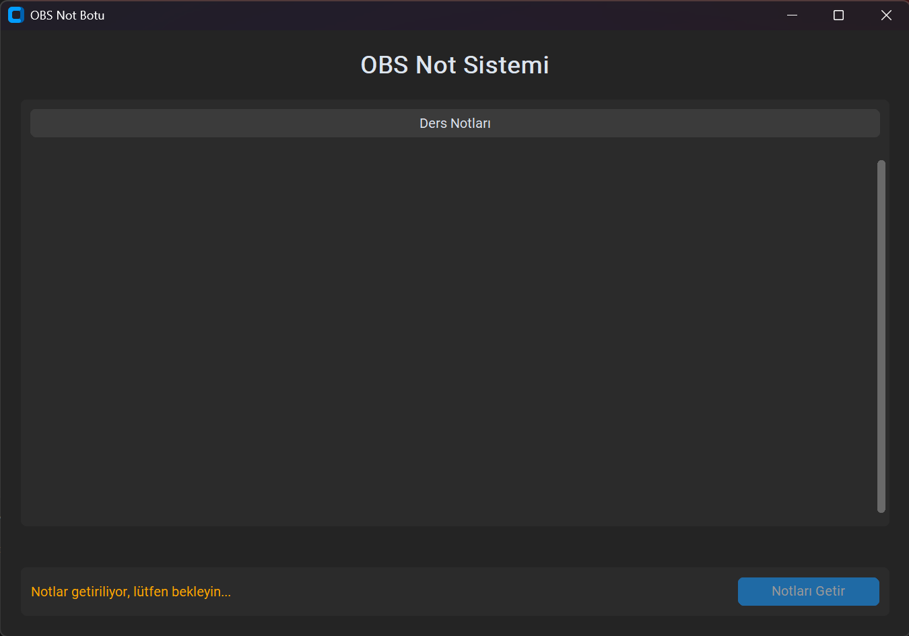
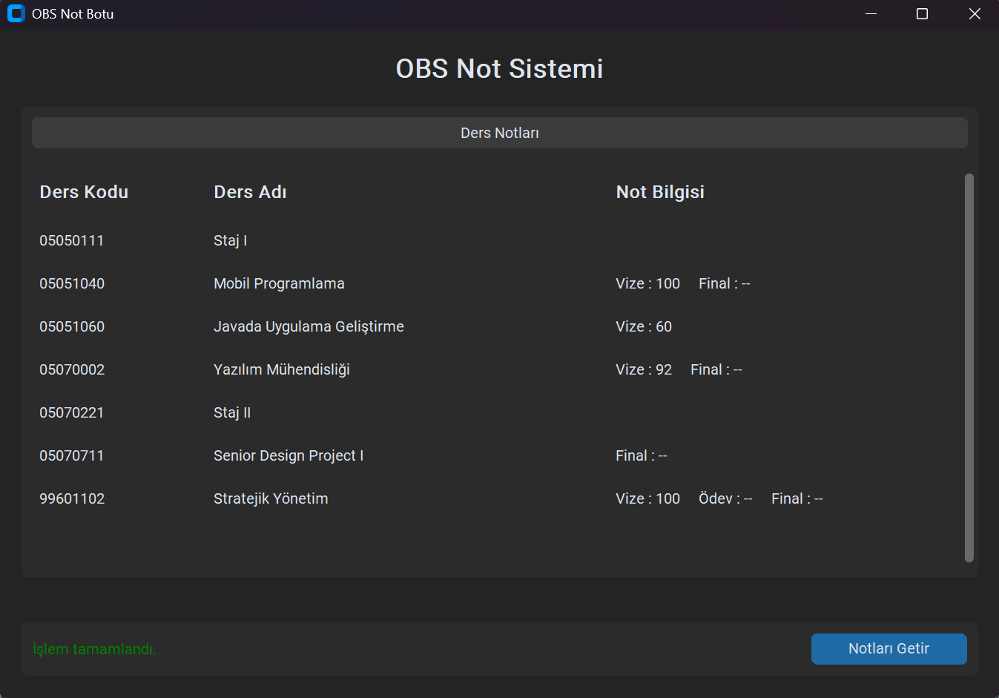
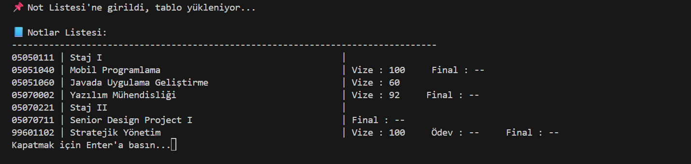

# 🎓 OBS Not Botu — Otomatik Not Görüntüleme Sistemi

<p align="center">
  
  
  
</p>

> **OBS Not Botu**, KTO Karatay Üniversitesi OBS sistemine e-Devlet üzerinden otomatik giriş yaparak notları çeken, analiz eden ve kullanıcıya hem konsol hem de modern bir arayüz üzerinden sunan bir otomasyon aracıdır.

## 📋 Proje Hakkında

Bu proje, sürekli OBS sistemine girip not kontrolü yapma zahmetini ortadan kaldırmak için geliştirilmiştir. **Selenium** kütüphanesi ile tarayıcı otomasyonu sağlanır, **e-Devlet** üzerinden güvenli giriş yapılır ve notlar anlık olarak çekilir.

- **Otomasyon**: Selenium & Webdriver Manager
- **Arayüz**: CustomTkinter (Modern UI)
- **Güvenlik**: `.env` dosyası ile kimlik bilgileri korunur
- **Esneklik**: İster konsoldan, ister grafik arayüzden kullanım

## 🖼️ Ekran Görüntüleri

### 1. Modern Arayüz (GUI)
Kullanıcı dostu, karanlık mod destekli modern arayüz ile notlarınızı şık bir tabloda görüntüleyin.

<p align="center">
  
  
  <br/>
  <em>OBS Not Botu - Grafik Arayüzü</em>
</p>

### 2. Konsol Çıktısı
Sadelikten yana olanlar için terminal üzerinden hızlı ve detaylı not listesi.

<p align="center">
  <br/>
  <em>Terminal / Konsol Görünümü</em>
</p>

## 🛠️ Kullanılan Teknolojiler

| Teknoloji | Açıklama |
|-----------|----------|
| **Python** | Ana programlama dili |
| **Selenium** | Web otomasyonu ve veri çekme (Scraping) |
| **CustomTkinter** | Modern Python GUI kütüphanesi |
| **Webdriver Manager** | Chrome sürücülerini otomatik yönetme |
| **Python-Dotenv** | Hassas verileri (TC, Şifre) güvenle saklama |

## 🚀 Kurulum

Projeyi kendi bilgisayarınızda çalıştırmak için aşağıdaki adımları izleyin.

### 1. Repoyu Klonlayın
```bash
git clone https://github.com/BurakYucelPY/OBS_NotBotu.git
cd OBS_NotBotu
```

### 2. Gerekli Paketleri Yükleyin
```bash
pip install -r requirements.txt
```

### 3. Yapılandırma (.env)
Proje ana dizininde `.env` adında bir dosya oluşturun ve kendi bilgilerinizi girin. Bu bilgiler **sadece sizin bilgisayarınızda** saklanır.

```ini
TC_KIMLIK=1234*******
E_DEVLET_SIFRE=e_devlet_sifreniz
```

## 💻 Kullanım

### Arayüz Modu (Önerilen)
Modern arayüzü başlatmak için:
```bash
python App.py
```

### Konsol Modu
Sadece terminal çıktısı almak için:
```bash
python OBS.py
```
---
<p align="center">
  Made with ❤️ by <a href="https://github.com/BurakYucelPY">Burak Yücel</a>
</p>
